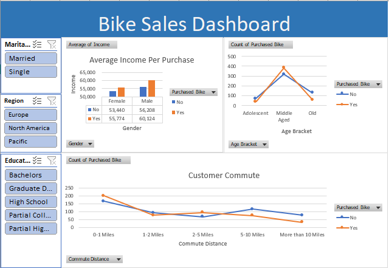

# 🚴‍♂️ Bike Sales Dashboard — Excel Project

This project analyzes bike purchasing behavior using demographic and lifestyle data.  
The final output is an **interactive Excel dashboard** built using Pivot Tables, Pivot Charts, Normalized Tables, and Slicers.

Dataset Source → Kaggle (Bike Sales in Europe Dataset)

---

# 🔗 Navigation

| Section | Link |
|--------|------|
|  Dashboard Preview | [link](#-dashboard-preview) |
|  Project Structure | [link](#-project-structure) |
|  Key Insights | [link](#key-insights) |
|  Tools Used | [link](#tools-used) |
|  How to Use | [link](#how-to-use) |
|  Dataset Source | [link](#dataset-source) |

---

# 📁 Project Structure

```
Bike-Sales-Excel-Dashboard/
│
├── data/
│   └── Sales.csv
│
├── dashboard/
│   ├── BikeSalesProject.xlsx
│   └── Bike_Sales_Dashboard.png
│
└── README.md
```

---

# 📊 Dashboard Preview

<p align="center">
  
</p>

The dashboard includes:

- **Average Income per Purchase (by Gender & Purchase status)**
- **Count of Bikes Purchased (by Age Bracket)**
- **Customer Commute Trends (Distance vs Purchase likelihood)**
- **Slicers:** Marital Status, Region, Education

---

# Key Insights

- **Married customers** have higher bike purchase rates  
- **Middle-aged customers** (31–54) dominate purchases  
- **Higher income groups** buy significantly more bikes  
- People with **shorter commute distances** purchase more often  
- **North America & Europe** lead in total purchases  

---

# Tools Used

- Microsoft Excel  
- Pivot Tables  
- Pivot Charts  
- Slicers (Interactive Filters)  
- Data Cleaning & Preparation  
- Dashboard Layout & Design  

---

# How to Use

1. Download `BikeSalesProject.xlsx` from the `dashboard/` folder.
2. Open it in Microsoft Excel.
3. Use slicers to filter by:
   - Gender  
   - Marital Status  
   - Region  
   - Education  
4. Review dashboard visuals to understand purchase patterns.
5. Explore Pivot Tables behind the scenes for deeper analysis.

---

# Dataset Source

Kaggle — https://www.kaggle.com/datasets/sadiqshah/bike-sales-in-europe

---

# Author

**Bhavishya Pancholi**  
Excel | Data Visualization | BI Dashboards | Analytics


